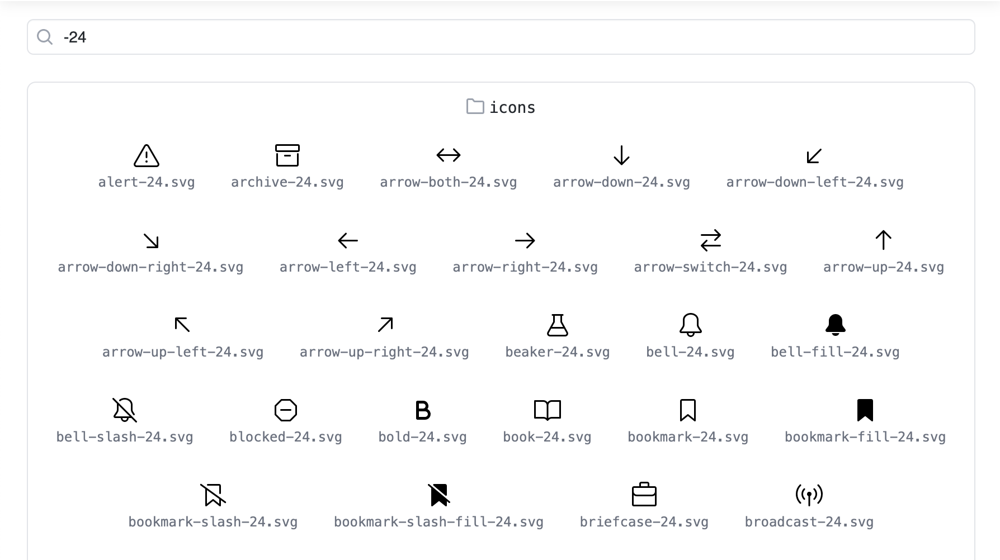

# GitHub Blocks

## GitHub Primer Colors

This Block visualizes the colors in a GitHub Primer theme. You can also edit the colors and save those changes back to the file.

## Images

This Block displays all of the images within a folder.
